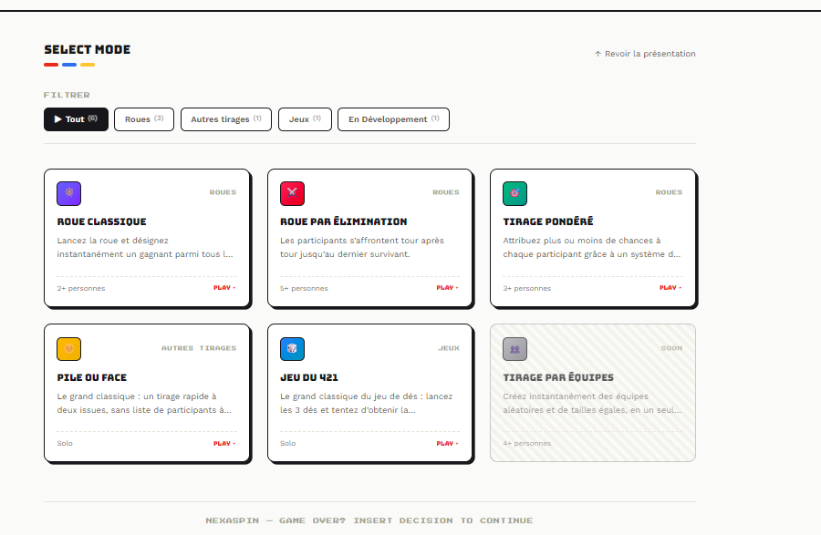
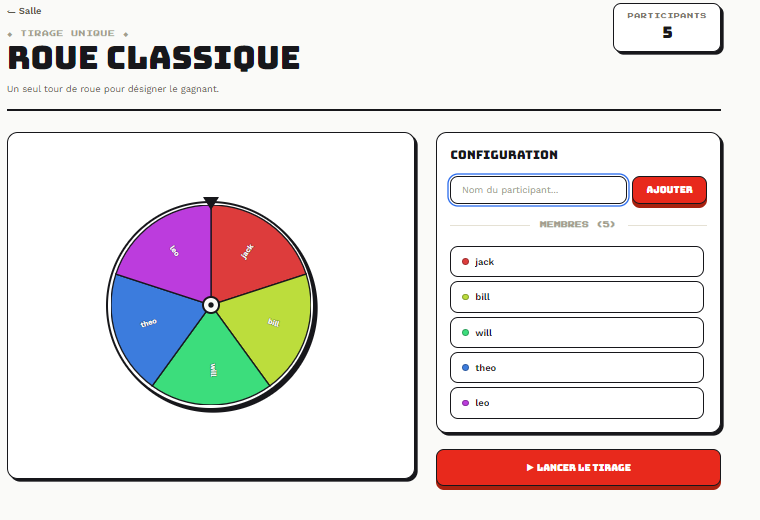
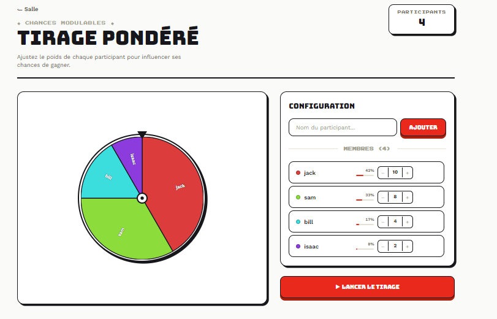
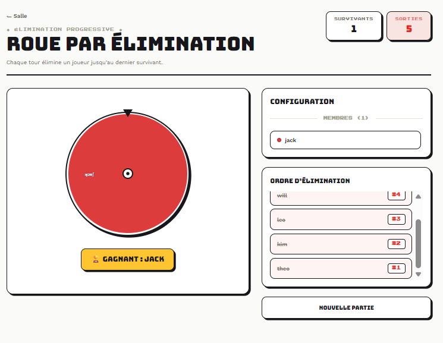
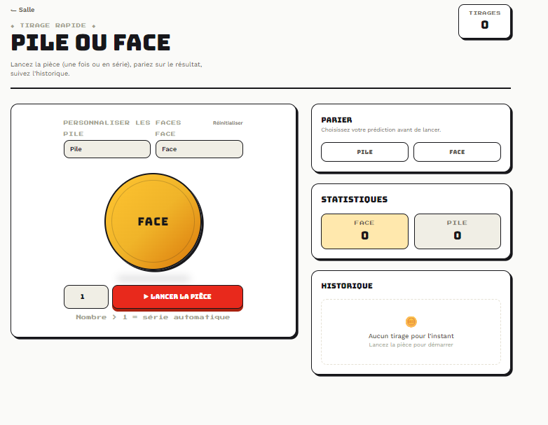
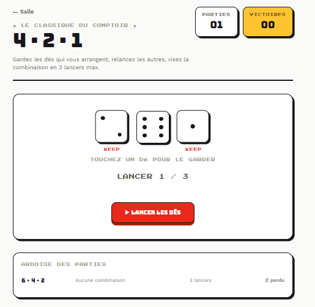

<div align="center">
<h1>🎲 NexaSpin </h1>


**Un projet d'apprentissage : refaire un tirage au sort en s'imposant une architecture propre**

[](https://php.net)
[](https://laravel.com)
[](https://livewire.laravel.com)
[](https://tailwindcss.com)
[](https://pestphp.com)
</div>


## 📖 Sommaire
- [📌 Statut du projet](#-statut-du-projet)
- [📸 Aperçu](#-aperçu)
- [🧱 Stack technique](#-stack-technique)
- [🏗️ Architecture](#️-architecture)
  - [Découpage par domaine métier](#découpage-par-domaine-métier)
  - [Principe directeur](#principe-directeur)
  - [Patterns clés](#patterns-clés)
- [🎯 Pourquoi cette architecture ?](#-pourquoi-cette-architecture-pour-un-tirage-au-sort-)
- [🔍 Exemple concret : un tirage pondéré](#-ce-qui-se-passe-réellement-quand-on-lance-un-tirage-pondéré)
- [⚠️ Dette technique et limites connues](#-dette-technique-et-limites-connues)
  - [Fonctionnel mais incomplet](#-fonctionnel-mais-incomplet)
  - [Corrigé récemment](#-corrigé-récemment)
- [📚 Ce que ce projet m’a servi à travailler](#-ce-que-ce-projet-ma-servi-à-travailler)
- [🚀 Installation](#-installation)
- [🧪 Tests et qualité de code](#-tests-et-qualité-de-code)
- [🗺️ Pistes pour la suite](#️-pistes-pour-la-suite)
- [💡 Pourquoi documenter les limites ?](#-pourquoi-ce-readme-documente-t-il-les-limites-)

---

## 📌 Statut du projet
*Terrain d’expérimentation : une fonctionnalité simple (tirage au sort) pour se concentrer sur l’architecture.*

| Mode | Description | État | Détails |
| --- | --- | --- | --- |
| 🎡 Roue classique | Tirage aléatoire simple et rapide pour désigner un seul gagnant. | ✅ Fonctionnel |  |
| ⚔️ Roue par élimination | Élimination progressive des participants jusqu'à ce qu'il n'en reste qu'un. | ✅ Fonctionnel |  |
| 🎯 Roue pondérée | Tirage aléatoire où chaque participant a un poids personnalisé pour influencer les résultats. | ✅ Fonctionnel | |
| 🪙 Pile ou face | Simule un lancer de pièce équitable entre deux options, avec système de paris (pile/face) et libellés personnalisables. | ✅ Fonctionnel | Carte active sur l’accueil, route et composant Livewire opérationnels, y compris les paris. Couvert par 6 fichiers de tests (Domain, Application, Livewire) et par le `throttle:120,1` partagé avec les routes de tirage. |
| 🎲 421 (dés) | Jeu de dés classique : gardez les dés qui vous arrangent, relancez les autres, visez la combinaison 4-2-1 en 3 lancers maximum. | ✅ Fonctionnel | Carte active sur l’accueil, route et composant Livewire opérationnels (`RollDiceAction`, `FourTwoOneStrategy`, `Dice421Page`). Couverture ajoutée dans cette révision (voir [Corrigé récemment](#-corrigé-récemment)). |
| 👥 Tirage par équipes | Permet de former des équipes de manière aléatoire (non encore développé). | 🔒 Non implémenté | Carte visible mais grisée sur l’accueil. |


> **Historique des tirages en cache** : chaque tirage (tous modes) est conservé côté serveur dans le cache (`App\Application\History\HistoryStore`), rattaché à la session du visiteur (1 mois de rétention). Page `/historique` : liste unifiée filtrable par mode, popup de détails (participants, poids, ordre des éliminations) pour les roues. Un résumé rapide des derniers tirages est aussi affiché directement sur chaque page de mode.
> **Aucune persistance en base de données** : les participants et résultats vivent dans l’état des composants Livewire (session uniquement) ; seul l’historique des tirages passe par le cache, pas de table dédiée.
> **Déploiement continu** : synchronisation automatique de `master` vers un VPS via GitHub Actions (sans porte de qualité, voir [Dette technique](#-dette-technique-et-limites-connues)).
> **Accueil organisé par catégorie** : les modes sont regroupés en sections (`GameModeCategory` : Roues / Autres tirages / Jeux / En Développement), générées dynamiquement — ajouter une nouvelle catégorie n’implique aucune modification de la vue.

---

## 📸 Aperçu

<!--
  Images à ajouter dans `docs/screenshots/` puis committer.
  Remplacer les liens ci-dessous une fois les fichiers présents (garder les mêmes noms
  ou mettre à jour les chemins). Format conseillé : PNG, 1280px de large max, thème clair
  (celui de l'app par défaut).
-->

| Accueil | Roue classique |
|---|---|
|  |  |

| Roue pondérée | Roue par élimination |
|---|---|
|  |  |

| Pile ou face | 421 |
|---|---|
|  |  |

---

---

## 🧱 Stack technique

| Catégorie | Technologies |
|----------|--------------|
| **Backend** | PHP 8.4 · Laravel 13 |
| **Interactivité** | Livewire 4 + Alpine.js (JS dédié pour l'animation des dés du 421, voir `resources/js/dice-game.js`) |
| **Frontend** | Tailwind CSS 4 (via `@tailwindcss/vite`) |
| **Tests** | Pest 4 (avec plugin Laravel) |
| **Analyse statique** | Larastan / PHPStan (niveau 5) |
| **Style de code** | Laravel Pint |
| **CI/CD** | GitHub Actions → déploiement `rsync` sur VPS |
| **Polices** | Work Sans, Bungee, Press Start 2P — auto-hébergées via `laravel-vite-plugin` (Bunny Fonts), sans appel externe |
| **SEO** | Meta title/description, Open Graph et Twitter Card par page, sitemap.xml généré automatiquement à partir des routes via `spatie/laravel-sitemap` (`php artisan sitemap:generate`), `robots.txt` |

---

## 🏗️ Architecture
*Séparation Domain / Application / UI, inspirée de la Clean Architecture et du DDD léger.*

### Découpage par domaine métier (`Draw`, `CoinFlip` et `Dice`)
```
app/
├── Domain/Draw/               # Règles métier pures (0 dépendance à Laravel)
│   ├── Entities/              # Draw (garantit l'invariant "≥ 2 participants")
│   ├── ValueObjects/          # Participant (nom + poids), DrawResult (immuables)
│   ├── Collections/           # Participants (typée, itérable)
│   ├── Enums/                 # DrawType (Random, Weighted), DrawDisplay
│   ├── Strategies/            # RandomDrawStrategy, WeightedDrawStrategy
│   ├── Contracts/             # DrawStrategy (interface)
│   └── Exceptions/
│
├── Domain/CoinFlip/           # Même logique appliquée au pile ou face
│   ├── Enums/                 # CoinSide
│   ├── ValueObjects/          # CoinFlipResult, CoinFlipBet (règle gagné/perdu)
│   ├── Strategies/            # RandomCoinFlipStrategy
│   └── Contracts/             # CoinFlipStrategy
│
├── Domain/Dice/                # Jeu de dés (421)
│   ├── Enums/                  # DiceCombination (421, Brelan, Suite, Aucune)
│   ├── ValueObjects/           # DiceRoll, DiceThrowResult (immuables)
│   ├── Support/                 # DiceCombinationEvaluator (détection de combinaison)
│   ├── Strategies/              # FourTwoOneStrategy (règles du 421 classique)
│   └── Contracts/               # DiceGameStrategy
│
├── Application/Draw/          # Orchestration (pont Domain ↔ UI)
│   ├── Actions/                # RunDrawAction (construit `Draw`, délègue à la stratégie)
│   ├── DTOs/                   # DrawData (transmet les données de l’UI au Domain)
│   ├── Resolvers/               # DrawStrategyResolver (point d'entrée unique)
│   └── Support/                 # WheelSegmentBuilder (segments SVG + rotation cumulée)
│
├── Application/CoinFlip/      # Orchestration du pile ou face
│   └── Actions/                # FlipCoinAction
│
├── Application/Dice/           # Orchestration du 421
│   └── Actions/                 # RollDiceAction (relance les dés non gardés, détecte fin de partie)
│
├── Application/Home/           # Read-model de la page d'accueil
│   ├── DTOs/                    # GameMode (carte affichée sur la home)
│   └── Enums/                   # GameModeType, GameModeCategory (regroupement de la home)
│
├── Application/History/        # Historique des tirages (transverse à tous les modes)
│   └── HistoryStore.php         # Lecture/écriture en cache, rattaché à la session (push/all/allModes/clear)
│
├── Http/Middleware/
│   └── SecurityHeaders.php    # CSP (prod uniquement) + en-têtes de sécurité HTTP
│
├── Console/Commands/
│   └── GenerateSitemap.php    # Commande `sitemap:generate` — découvre les routes GET publiques automatiquement
│
└── Livewire/
    ├── Draw/                   # WheelPage, EliminationWheelPage, WeightedWheelPage
    │   └── Concerns/            # ManagesParticipants, HandlesDraw (traits partagés)
    ├── CoinFlip/
    │   └── CoinFlipPage.php    # Tirage simple/multiple + paris + libellés personnalisables
    ├── Dice/
    │   └── Dice421Page.php     # Partie de 421 : lancers, dés gardés, historique local
    └── History/
        └── HistoryPage.php     # Page /historique : liste unifiée tous modes, filtrable
```

> **Nomenclature** : les DTO/enums de la home s'appellent désormais `GameModeType` / `GameModeCategory` (et non plus `DrawModeType` / `DrawModeCategory`), suite à l'ajout du 421 qui n'est pas un mode de *tirage* à proprement parler.

### Principe directeur
- **Domain** : Ignore Laravel/Livewire. Testable en PHP pur.
- **Application** : Orchestre les cas d’usage (ex. : `RunDrawAction` construit `Draw` puis appelle `$strategy->draw()`).
- **Livewire** : Gère uniquement l’état UI et délègue la logique métier.

### Patterns clés
- **Strategy** : `RandomDrawStrategy` et `WeightedDrawStrategy` implémentent `DrawStrategy`. Le branchement se fait en un seul point (`DrawStrategyResolver::resolve()`).
- **Double Dispatch** : `Draw::execute($strategy)` délègue à la stratégie sans connaître son implémentation.
- **Always-Valid Entity** : `Draw` valide ses invariants (ex. : ≥ 2 participants) dans son constructeur.
- **DTO** : `DrawData` transmet les données de l’UI au Domain sans couplage.

---

## 🎯 Pourquoi cette architecture pour un tirage au sort ?
*Un tirage au sort tient en 30 lignes avec `array_rand()`. Découper le code en couches ajoute de la complexité... mais c’est voulus.*

### Avantages
- **Testabilité** : Le Domain se teste sans base de données, sans HTTP, sans Livewire.
- **Portabilité** : `Draw`, `Participant`, `RandomDrawStrategy` pourraient être copiés dans un projet PHP sans Laravel.
- **Évolutivité** : Ajouter un nouveau type de tirage (ex. : équipes) ne nécessite que :
  1. Une nouvelle stratégie (`TeamDrawStrategy`).
  2. Une entrée dans `DrawType`.
  3. Une route et un composant Livewire.

### Coûts assumés
- **Plus de fichiers** : 1 fonctionnalité simple = plus de couches, plus d’indirection.
- **Courbe d’apprentissage** : Un nouveau contributeur doit comprendre la structure avant de modifier le code.
- **Risque de bugs** : Plus de couches = plus d’endroits où une intention peut se perdre (ex. : le bug du tirage pondéré, voir ci-dessous).

> **Le compromis** : Ce projet n’est pas optimisé pour la livraison rapide, mais pour **comprendre où cette architecture aide et où elle coûte**.

---

## 🔍 Ce qui se passe réellement quand on lance un tirage pondéré
*Exemple concret de trajet à travers les couches :*

1. **`WeightedWheelPage`** (Livewire) : Surcharge `drawType()` pour retourner `DrawType::WEIGHTED`.
2. **`HandlesDraw::executeDraw()`** : Construit un `DrawData` (DTO) avec les participants, leurs poids, et appelle `$this->drawType()` pour transmettre le bon type.
3. **`RunDrawAction::execute()`** :
   - Demande à `DrawStrategyResolver` la stratégie pour `DrawType::WEIGHTED`, qui résout bien `WeightedDrawStrategy`.
   - Construit l’entité `Draw` à partir de `$data->participantsCollection()`. Le constructeur valide qu’il y a ≥ 2 participants.
4. **`Draw::execute($strategy)`** : Délègue à `$strategy->draw($this->participants)` (Double Dispatch).
5. **`WeightedDrawStrategy::draw()`** :
   - Calcule la somme des poids.
   - Tire un `random_int(1, $totalWeight)`. 
   - Parcourt les participants en cumulant leurs poids jusqu’à dépasser le nombre tiré (algorithme *Roulette Wheel Selection*).
6. **Résultat** : Le `DrawResult` (Value Object immuable) remonte jusqu’à Livewire pour mise à jour de l’affichage.
   - **En parallèle** : `WheelSegmentBuilder` calcule la taille des segments SVG **proportionnellement aux poids** (les parts inégales sont désormais visibles à l’écran).

---

## ⚠️ Dette technique et limites connues

### 🟡 Fonctionnel mais incomplet
- **Déploiement sans porte de qualité** : Le workflow GitHub Actions déploie directement sur `master` sans exécuter `composer test` ou `composer run analyse`.
- **Pas de persistance** : Les tirages ne sont pas sauvegardés en base de données (choix assumé pour l’instant).
- **Tirage par équipes non implémenté** : Carte visible mais désactivée (`available: false`) sur l’accueil.

### ✅ Corrigé récemment
- **Historique des tirages en cache** : `App\Application\History\HistoryStore` enregistre chaque tirage (tous modes) en cache, rattaché à la session du visiteur (session étendue à 3 mois dans `config/session.php` pour ne pas perdre l'historique après 2h d'inactivité ; rétention du cache 1 mois). Nouvelle page `/historique` (composant `HistoryPage`) : liste unifiée de tous les tirages, filtrable par mode, avec popup de détails (participants, poids, ordre des éliminations) pour les roues. Chaque page de mode affiche aussi un résumé rapide de ses derniers tirages, avec lien vers l'historique complet. Sur `CoinFlipPage`, les tirages multiples (série auto) sont désormais des entrées distinctes des tirages simples (`type: 'single'|'multiple'`), avec gagnant de la série calculé au max de faces.
- **Résultat affiché seulement après la fin de l'animation** : sur les 5 modes, le résultat n'atterrit dans l'historique/le résumé rapide qu'après la fin de l'animation côté client (+ court délai réglable, actuellement 500ms) plutôt qu'instantanément à la requête Livewire — évite de spoiler le résultat avant que l'animation ne soit terminée visuellement (`pendingHistoryEntries`/`confirmFlip()` pour le pile ou face, `pendingHistoryEntry`/`confirmDraw()` pour les roues classique et pondérée, `pendingTournamentEntry`/`confirmTournamentHistory()` pour la roue d'élimination — cette dernière ne différant que la mise en historique du tournoi, pas la logique de jeu elle-même qui doit rester synchrone).
- **Refonte visuelle complète, direction « borne d’arcade »** : nouvelle palette néo-brutaliste à ombres dures (`--shadow-hard`, `--shadow-press`), nouvelles polices auto-hébergées (Work Sans, Bungee, Press Start 2P via Bunny Fonts/Vite), nouveaux utilitaires CSS (`btn-press`, `card-hard`, `card-hard-hover`, `tile-selected`, `text-outline`) et prise en charge de `prefers-reduced-motion`. Appliquée à l’accueil, aux cartes de mode, à la roue, au pile ou face et au 421. Ajout d’un logo.
- **Résolution du bug de polices bloquées par la CSP sur `/421`** : le `<link>` direct vers `fonts.googleapis.com`/`fonts.gstatic.com` a été supprimé ; les polices passent désormais par le même pipeline Vite que le reste du site (plus de retombée silencieuse sur la police système en production).
- **Historique et compteur du 421 différés jusqu’à la fin de l’animation** : `roll()` ne pousse plus l’entrée d’historique immédiatement mais la stocke dans `pendingHistoryEntry` (`#[Locked]`) et appelle `skipRender()` ; c’est `finalizeRoll()`, déclenché par Alpine à la fin de l’animation des dés, qui l’applique. Évite que le résultat ou l’historique n’apparaissent avant que l’animation soit terminée.
- **Ajout des tests du jeu de dés 421** : `RollDiceAction`, `FourTwoOneStrategy`, `DiceCombinationEvaluator`, `DiceRoll`, `Dice421Page` sont désormais couverts par des tests (Domain, Application, Livewire) — l’implémentation existait déjà mais n’était pas testée et n’apparaissait pas dans ce README.
- **Correction du statut « Pile ou face » dans ce README** : contrairement à ce qu’indiquait une précédente version, `FlipCoinAction`, `RandomCoinFlipStrategy`, `CoinFlipBet`, `CoinFlipResult` et `CoinFlipPage` (y compris les paris) sont bien couverts par 6 fichiers de tests, et la route `/pile-ou-face` a bien un `throttle:120,1`.
- **Sitemap généré automatiquement à partir des routes** : `GenerateSitemap` n’énumère plus les routes à la main ; il parcourt `Route::getRoutes()` et ne garde que les routes GET, nommées, sans paramètre et hors routes internes Livewire (`livewire.*`). Toute nouvelle route publique apparaît donc dans le sitemap sans y toucher, avec une priorité par défaut (`0.5`) surchargeable via la constante `PRIORITIES`.
- **Sécurité HTTP** : ajout de `SecurityHeaders` (CSP appliquée uniquement en production — Vite/HMR ont besoin d’une origine séparée en dev —, `X-Frame-Options`, `X-Content-Type-Options`, `Referrer-Policy`, `Permissions-Policy`), et `throttle:120,1` sur les routes de tirage.
- **Aléatoire non cryptographique corrigé** : `Participants::random()` utilise désormais `random_int()` (CSPRNG) au lieu d’`array_rand()`, cohérent avec `WeightedDrawStrategy`.
- **Bug de rotation de roue à la relance** : `WheelPage` et `WeightedWheelPage` dispatchaient un angle **absolu** à un composant Alpine qui **accumule** les rotations (`rotation += ...`) — la roue s’arrêtait au mauvais endroit après un premier tirage. Corrigé via `WheelSegmentBuilder::cumulativeRotationFor()`, qui calcule un delta relatif à la rotation déjà appliquée (logique déjà en place sur `EliminationWheelPage`, désormais centralisée et partagée par les trois pages).
- **Blocage possible sur la roue d’élimination** : ajout d’un détecteur d’état bloqué (`isStuck()`/`unstick()`) si `confirmElimination()` n’est jamais rappelée (ex. coupure réseau pendant l’animation).
- **`CoinFlipPage::$bet` verrouillée** (`#[Locked]`) : empêche un payload Livewire forgé de fixer `$bet` à une valeur arbitraire côté client ; `evaluateBet()` utilise `CoinSide::tryFrom()` en défense en profondeur plutôt que `from()`.
- **Accueil regroupé par catégorie** : nouvel enum `GameModeCategory` (Roues / Autres tirages / Jeux), `GameModeType::grouped()` génère les sections dynamiquement — une catégorie sans mode actif n’apparaît pas, et en ajouter une nouvelle ne nécessite aucune modification de `home.blade.php`. *(Ces enums s'appelaient `DrawModeCategory`/`DrawModeType` au moment de ce commit, renommés depuis en `GameModeCategory`/`GameModeType` suite à l'ajout du 421.)*
- **Accueil responsive** : catégories en colonnes auto-adaptatives (`grid-cols-[repeat(auto-fit,minmax(280px,1fr))]`, pas de nombre codé en dur) à partir de `md:` ; sur mobile, chaque catégorie est un accordéon repliable (Alpine.js, première catégorie ouverte par défaut) pour éviter une page à rallonge. `<x-mode-card>` a deux mises en page distinctes : carte verticale complète dès `md:`, rangée horizontale compacte (icône + titre/description tronqués + chevron) en dessous. Les effets `hover` sont désormais gated par `md:group-hover:` pour ne jamais rester "collés" après un tap tactile.
- **Ajout des paris sur pile ou face** : `CoinFlipBet` (Domain) porte la règle gagné/perdu, historique des paris et libellés de faces personnalisables (`pileLabel`/`faceLabel`).
- **Bug du tirage pondéré résolu** : `HandlesDraw::executeDraw()` appelle désormais `$this->drawType()` au lieu d’un `DrawType::RANDOM` codé en dur ; `WeightedDrawStrategy` est bien invoquée.
- **Segments SVG proportionnels aux poids** : `WheelSegmentBuilder` calcule désormais la taille des parts selon `Participant::$weight`.
- **Implémentation du Pile ou face** : `FlipCoinAction`, `RandomCoinFlipStrategy`, `CoinFlipPage` et la route `/pile-ou-face` sont en place et actifs sur l’accueil.
- Fusion de `DrawFactory` et `DrawStrategyResolver` en un seul point de résolution.
- Alignement des namespaces et dossiers.
- Réparation de la suite de tests (`phpunit.xml`, script `composer test`).
- Implémentation de `WeightedDrawStrategy` (algorithme *Roulette Wheel Selection*).
- Passage de `RunDrawAction` par l’entité `Draw` pour appliquer ses invariants.
- Correction de `composer run setup` pour un clone frais.

---

## 📚 Ce que ce projet m’a servi à travailler
*Une liste non exhaustive des concepts et bonnes pratiques appliqués.*

| Concept | Implémentation dans NexaSpin |
|---------|-------------------------------|
| **Séparation des couches** | Domain (règles métier) / Application (orchestration) / UI (Livewire). |
| **Entity vs Value Object** | `Draw` (Entity avec identité et invariants) vs `Participant`/`DrawResult` (Value Objects immuables). |
| **Pattern Strategy** | `RandomDrawStrategy` et `WeightedDrawStrategy` derrière l’interface `DrawStrategy`. |
| **Double Dispatch** | `Draw::execute($strategy)` délègue à la stratégie sans connaître son type. |
| **DTO** | `DrawData` pour transmettre des données de l’UI au Domain sans couplage. |
| **Traits PHP** | `ManagesParticipants`, `HandlesDraw` pour éviter la duplication entre composants Livewire. |
| **Génération SVG dynamique** | `WheelSegmentBuilder` calcule les coordonnées polaires → cartésiennes pour la roue. |
| **Algorithme Roulette Wheel** | Tirage pondéré via cumul des poids et `random_int`. |
| **Tests Livewire** | Couverture des composants (ajout/suppression/édition de participants, tirages). |
| **Analyse statique** | Larastan/PHPStan niveau 5 + documentation des `ignoreErrors`. |
| **CI/CD** | Déploiement automatique via GitHub Actions (à améliorer avec des portes de qualité). |
| **En-têtes de sécurité HTTP** | Middleware `SecurityHeaders` (CSP conditionnelle à l’environnement, `X-Frame-Options`, etc.) + `throttle` sur les routes sensibles. |
| **Read-model + regroupement par enum** | `GameModeCategory` pilote les sections de la home ; `GameModeType::grouped()` reste la seule source de vérité, la vue ne fait qu’itérer. |

<details>
<summary><strong>📜 Historique des commits clés</strong></summary>
<br>

| Commit | Apport |
|--------|--------|
| `init roulette v2` | Reprise d’une v1 plus simple. |
| `add livewire` | Introduction de Livewire pour l’interactivité. |
| `Domain` puis `Application` | Extraction des règles métier hors des composants Livewire. |
| `Début UI` + `debug + ajout roue visuel` | Construction de la roue en SVG généré côté serveur. |
| `elimination` | Mode multi-étapes avec confirmation d’animation. |
| `refonte` + `rename drawfactory` | Retour sur des noms et une structure plus cohérents. |
| `merge factory/resolver` | Fusion des mécanismes concurrents de résolution de stratégie. |
| `fix setup script + tests` | Réparation de `composer run setup`, `phpunit.xml`, et tests Livewire. |
| `WeightedDrawStrategy + WeightedWheelPage` | Implémentation du tirage pondéré et de son écran dédié. |
| `wire Draw entity into RunDrawAction` | `RunDrawAction` passe par l’entité `Draw` (Double Dispatch). |
| `test updateParticipant + Larastan + deploy.yml` | Couverture de l’édition inline, analyse statique, et pipeline de déploiement. |
| `tirage ponderer segment = poids` | Correction du bug : les segments SVG suivent enfin les poids réels. |
| `implémentation Coin Flip` | Ajout du mode Pile ou face (`FlipCoinAction`, `RandomCoinFlipStrategy`, `CoinFlipPage`), désormais actif sur l’accueil. |
| `Label coin flip` + `paris` | Ajout des paris pile/face et des libellés de faces personnalisables. |
| `Securité` | `SecurityHeaders` (CSP prod-only), `throttle` sur les routes de tirage, `random_int()` au lieu d’`array_rand()`, verrouillage de `CoinFlipPage::$bet`. |
| `debug wheel a la relance de la roue` | Correction du bug de rotation absolue vs cumulative sur `WheelPage`/`WeightedWheelPage`, ajout du détecteur de blocage sur `EliminationWheelPage`. |
| `accueil par catégories` | `DrawModeCategory` + `DrawModeType::grouped()` : sections de la home générées dynamiquement. |
| `accueil responsive mobile` | Colonnes auto-adaptatives, accordéon Alpine.js par catégorie sur mobile, carte compacte dédiée, hover limité à `md:`. |
| `implémentation 421` + `Debug 421` + `test 421` | Ajout du jeu de dés 421 et de sa suite de tests. |
| `design type borne arcade` + `redisign` | Refonte visuelle néo-brutaliste « borne d’arcade » : nouvelle palette à ombres dures, nouvelles polices auto-hébergées (Work Sans, Bungee, Press Start 2P), nouveaux utilitaires CSS, ajout du logo. |
| `attendre fin annimation pour compteur et historique` | Historique et compteur du 421 appliqués seulement après la fin de l’animation Alpine (`pendingHistoryEntry` + `finalizeRoll()`). |
| `historique en cache` + `popup details roues` | `HistoryStore`, page `/historique` unifiée et filtrable, résumés rapides par mode, résultat différé après animation sur les 5 modes, popup de détails (participants/poids/éliminations) pour les roues. |

</details>

---

## 🚀 Installation

### Prérequis
- PHP 8.4
- Composer
- Node.js (pour Tailwind CSS)

### Étapes
```bash
# Cloner le dépôt
git clone https://github.com/DocCreeps/NexaSpinV2.git
cd NexaSpinV2

# Installer les dépendances PHP et générer la clé d'application
composer install
cp .env.example .env
php artisan key:generate

# Installer et builder les assets front
npm install
npm run build
```

**Alternative** : Un script `composer run setup` regroupe toutes ces étapes (sauf la configuration de base de données, non nécessaire).

### Lancement en local
```bash
composer run dev
```
L’application sera accessible sur **[http://localhost:8000](http://localhost:8000)**.

---

## 🧪 Tests et qualité de code

### Exécuter les tests
```bash
composer test
```
- **160+ déclarations de test** (Pest) couvrant :
  - Gestion des participants (ajout/suppression/édition, y compris pondération).
  - Résolution de stratégie et exécution des tirages.
  - Tirage pondéré (résultat **et** segments SVG proportionnels).
  - Déroulé complet d’une élimination.
  - Pile ou face : tirage simple/multiple, système de paris, libellés personnalisés, statistiques.
  - 421 : lancer de dés (dés gardés vs relancés), détection de combinaison (421, brelan, suite), fin de partie, historique.
  - Chargement des routes.
  - Génération des segments SVG.

### Analyse statique
```bash
composer run analyse
```
- Larastan / PHPStan niveau 5.
- Les exceptions volontaires sont documentées dans `ignoreErrors`.

---

## 🗺️ Pistes pour la suite
*Par ordre de priorité.*


- [ ] **Design** :
  - Responsive, accessibilité.
- [ ] **Améliorer le pipeline de déploiement** :
  - Ajouter `composer test` et `composer run analyse` comme portes de qualité dans `deploy.yml`.
- [ ] **Implémenter le mode manquant** :
  - Tirage par équipes (`GameModeType::TEAMS`).
- [ ] **Peaufiner Pile ou face** (voir `TODO`) :
  - Amélioration du design.
- [ ] **Persistance en base de données** :
  - L'historique des tirages passe aujourd'hui par le cache (rattaché à la session, 1 mois) plutôt qu'une vraie table — suffisant pour l'usage actuel, mais une migration vers une table dédiée permettrait un historique multi-appareils/compte et sans limite de rétention, si un besoin réel émerge.

---

## 💡 Pourquoi ce README documente-t-il les limites ?
*Parce que repérer et assumer les trous fait partie de l’exercice autant que d’écrire le code.*

> *"Un README qui ne mentionne que ce qui marche est un mensonge par omission. Celui-ci liste aussi ce qui est cassé, incomplet, ou à améliorer — pour que le prochain qui lit ce code (moi y compris) sache exactement où en est le projet."*

---

<div align="center">

Fait avec 🎲 par [DocCreeps](https://github.com/DocCreeps)

</div>
